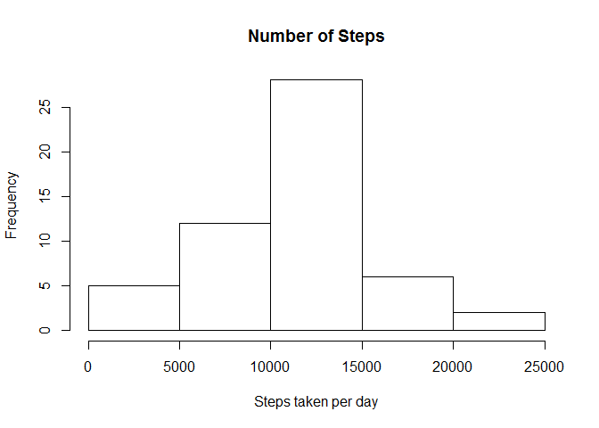
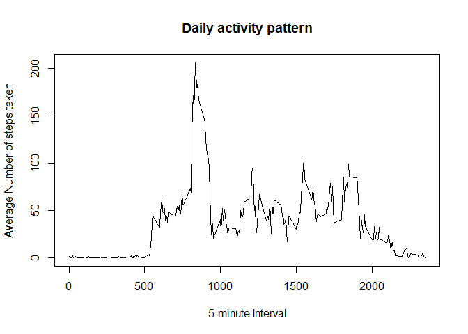
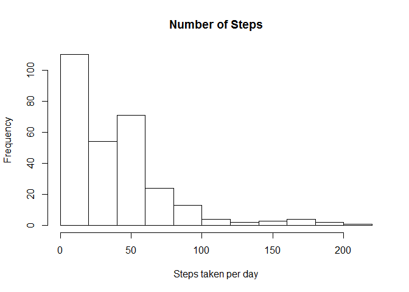

# Reproducible Research: Peer Assessment 1


## Loading and preprocessing the data


```r
df <- read.csv("G:/RProg/activity.csv")
dfNA <- df[!is.na(df$steps), ]
```


## What is mean total number of steps taken per day?


```
## Warning: package 'plyr' was built under R version 3.1.3
```

 

####Mean and Median of the total number of steps taken per day


```r
mean(stepsByDay$steps)
```

```
## [1] 10766.19
```

```r
median(stepsByDay$steps)
```

```
## [1] 10765
```

## What is the average daily activity pattern?

 

#### Which 5-minute interval, on average across all the days in the dataset, contains the maximum number of steps?

```r
averageByInterval[averageByInterval$steps == max(averageByInterval$steps), ]
```

```
##     interval    steps
## 104      835 206.1698
```

```r
colnames(averageByInterval)[2] <- "intervalAvg"
```


## Imputing missing values

#####Total number of rows with NAs

```r
nrow(df[is.na(df$steps), ])
```

```
## [1] 2304
```

#####Fill NAs with mean for that 5-min interval

```r
dfNoNA <- arrange(join(df, averageByInterval), interval)
```

```
## Joining by: interval
```

```r
dfNoNA$steps[is.na(dfNoNA$steps)] <- dfNoNA$intervalAvg[is.na(dfNoNA$steps)]
```


#####Recalculate the average daily pattern
 

####Mean and Median of the total number of steps taken per day


```r
mean(stepsByDayNoNA$steps)
```

```
## [1] 37.3826
```

```r
median(stepsByDayNoNA$steps)
```

```
## [1] 34.11321
```

## Are there differences in activity patterns between weekdays and weekends?

```r
library(lattice)
```

```
## Warning: package 'lattice' was built under R version 3.1.3
```

```r
weekdays <- weekdays(as.Date(dfNoNA$date))
dfWeekdays <- transform(dfNoNA, day = weekdays)
dfWeekdays$wk <- ifelse(dfWeekdays$day %in% c("Saturday", "Sunday"), 
    "weekend", "weekday")
averageIntervalByweek <- ddply(dfWeekdays, .(interval, wk), summarise, 
    steps = mean(steps))

xyplot(steps ~ interval | wk, data = averageIntervalByweek, layout = c(1, 2), 
    type = "l")
```

 
